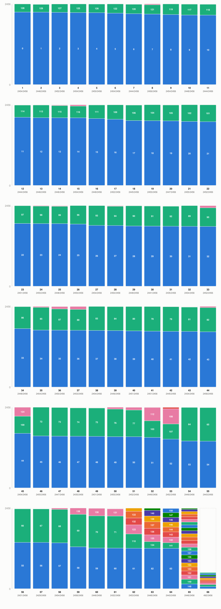

# A worked example: reading a solution

[← Back to README](../README.md)

The figure below is one certified-optimal 66-bin solution for a real
201-item benchmark instance (`201_2500_NR_0`, capacity 2456): each column
is one bin, height is capacity, and each colored block is one item,
labeled with its index and sized to its weight.

## Reading the figure

All 66 bins are shown, 24 per row, in the same order the solver reports
them. Each bin is a column as tall as the capacity (2456); inside it,
every item the solver placed there is a colored block stacked from the
bottom, as tall as that item's weight and labeled with the item's index
from the instance file. A bin's blocks always sum to at most the capacity
line at the top of the column — the packing constraint the solver has to
satisfy for every one of the 66 columns at once.

## What the bins look like on average

On average a bin holds **3.05 items** (from a minimum of **2** to a
maximum of **24**) and is filled to **98.5%** of capacity — this instance
is deliberately hard to pack tightly. Most bins
(60 of 66) follow the same shape: one large item (roughly 90% of the
capacity by itself) plus one or two small "filler" items that round it out
almost exactly to the top — typical of the ANI benchmark family, whose
difficulty comes from items sized just under half the capacity (see
[Input](INPUT.md)). The last few bins (5 of 66, visible as the denser
columns near the end) instead absorb six or more small leftover items
each — a structurally different packing the solver has to prove is
simultaneously optimal alongside the simpler one-large-item bins, not
just find by itself.

---

See also: [Input format](INPUT.md) · [Output format](OUTPUT.md) · [Usage](USAGE.md)
